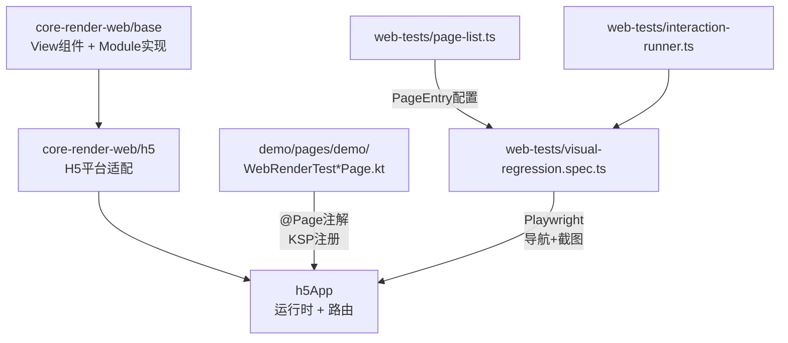
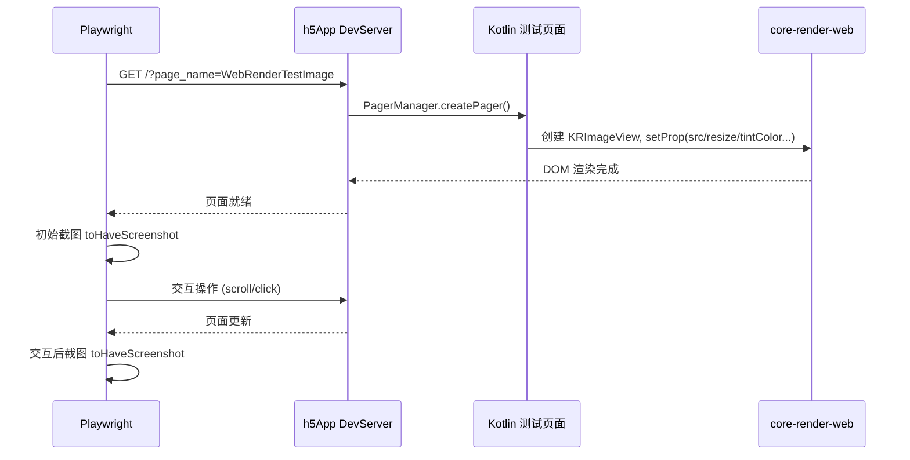

## 用户需求

基于 `core-render-web/base` 和 `core-render-web/h5` 中实现的所有 View 组件和 Module 模块，编写专门的 Playwright 测试页面，全面覆盖所有属性和方法，弥补现有 demo 页面属性覆盖不完整的问题。

## 产品概述

当前项目已有基于 Playwright 的视觉回归测试框架，但测试页面全部复用 demo 中已有的演示页面，这些页面并非为测试设计，许多 render 层属性和模块方法没有被覆盖到。需要创建一套专门的、系统化的测试页面（Kotlin KTV DSL 编写），每个页面聚焦于一个 View 组件或 Module 模块，确保其全部 `setProp` 属性和 `call` 方法都被覆盖，并在 `page-list.ts` 中注册对应的测试条目。

## 核心功能

### 一、View 组件属性全覆盖测试页面

需要创建以下测试页面，每个页面系统性地展示对应组件的所有属性效果：

1. **通用属性测试页** -- 覆盖 `setCommonProp` 中的全部属性：frame、opacity、visibility、overflow、backgroundColor、touchEnable、transform（rotate/scale/translate/skew）、backgroundImage（线性渐变）、boxShadow、textShadow、strokeWidth/strokeColor、borderRadius（含各角独立）、border、maskLinearGradient、color、zIndex、accessibility/accessibilityRole
2. **KRView 测试页** -- 覆盖 pan、superTouch、touchDown/Move/Up、doubleClick、longPress、screenFrame/screenFramePause 等手势事件属性
3. **KRImageView 测试页** -- 覆盖 src（URL/assets/base64）、resize（stretch/contain/cover）、tintColor、blurRadius、loadSuccess/loadFailure/loadResolution 回调
4. **KRRichTextView 测试页** -- 覆盖 numberOfLines、lineBreakMode、headIndent、values（富文本JSON含Span）、text、color、letterSpacing、textDecoration、textAlign、lineSpacing、lineHeight、fontWeight/fontStyle/fontFamily/fontSize、backgroundImage（渐变文字）、strokeWidth/strokeColor、spanRect call 方法
5. **KRTextFieldView 测试页** -- 覆盖 text、placeholder、placeholderColor、textAlign、fontSize、fontWeight、tintColor、maxTextLength、editable、autofocus、keyboardType、returnKeyType 及 setText/focus/blur/getCursorIndex/setCursorIndex call 方法
6. **KRTextAreaView 测试页** -- 与 TextField 类似但验证多行场景
7. **KRListView/KRScrollView 测试页** -- 覆盖 scroll、scrollEnabled、showScrollerIndicator、directionRow、pagingEnabled、bouncesEnable、nestedScroll、dragBegin/dragEnd/willDragEnd/scrollEnd 及 contentOffset/contentInset call 方法
8. **KRVideoView 测试页** -- 覆盖 src、muted、rate、resizeMode、playControl 及状态回调
9. **KRCanvasView 测试页** -- 覆盖全部 20+ 个绘图 call 方法（beginPath/moveTo/lineTo/arc/fill/stroke 等）
10. **KRActivityIndicatorView 测试页** -- 覆盖 style（gray/white）属性
11. **KRBlurView 测试页** -- 覆盖 blurRadius 属性
12. **KRHoverView 测试页** -- 覆盖 hoverMarginTop、bringIndex 属性
13. **KRMaskView 测试页** -- 覆盖遮罩效果

### 二、Module 模块方法全覆盖测试页面

1. **KRCalendarModule 测试页** -- 覆盖 cur_timestamp、get_field、get_time_in_millis、format、parse_format
2. **KRCodecModule 测试页** -- 覆盖 urlEncode/urlDecode、base64Encode/base64Decode、md5/md5With32、sha256
3. **KRLogModule 测试页** -- 覆盖 logInfo/logDebug/logError
4. **KRMemoryCacheModule 测试页** -- 覆盖 setObject/get
5. **KRSharedPreferencesModule 测试页** -- 覆盖 getItem/setItem
6. **KRNotifyModule 测试页** -- 覆盖 addNotify/removeNotify/postNotify
7. **KRRouterModule 测试页** -- 覆盖 openPage/closePage
8. **KRNetworkModule 测试页** -- 覆盖 httpRequest/httpRequestBinary
9. **H5WindowResizeModule 测试页** -- 覆盖 listenWindowSizeChange/removeListenWindowSizeChange

### 三、Playwright 测试配置

在 `page-list.ts` 中为每个新建测试页面添加 PageEntry 条目（使用新的 `category: 'render-test'`），配置必要的交互组（如需要点击按钮触发事件验证、需要滚动查看更多内容等）。

## 技术栈

- **测试页面**：Kotlin Multiplatform + KTV 声明式 DSL（继承 BasePager）
- **测试框架**：Playwright + TypeScript
- **页面注册**：@Page 注解 + KSP 编译期自动注册
- **视觉回归**：Playwright toHaveScreenshot 截图对比

## 实现方案

### 整体策略

采用"按组件/模块拆分测试页面"策略：每个 View 组件和 Module 模块各创建一个专门的测试页面，页面内部以分区块的方式展示该组件的每一个属性效果。页面统一继承 `BasePager`，使用 KTV 声明式 DSL 构建 UI，通过 `@Page` 注解注册路由。

### 关键技术决策

1. **使用 KTV DSL 而非 Compose 模式**：现有大部分 demo 页面使用 KTV DSL，且 KTV DSL 与底层 render 属性的映射更直接（`ViewConst.TYPE_VIEW` → `KRView`），更适合精确测试每个属性。

2. **测试页面放置在 `demo/src/commonMain/.../pages/demo/` 目录下**：遵循现有页面放置惯例，所有测试页面使用 `WebRenderTest` 前缀统一命名，便于识别和管理。

3. **category 使用 `'render-test'`**：在 page-list.ts 中新增分类，与已有 `'demo'` 页面区分，便于按需运行测试。

4. **Module 测试通过 UI 反馈验证**：Module 方法的返回值通过 Text 组件展示在页面上，用视觉截图对比验证结果正确性。对于异步回调（如 Network），通过 observable 状态驱动 UI 更新后截图。

5. **事件类属性通过状态文本验证**：手势事件（pan、click、doubleClick、longPress 等）触发后更新一个状态文本显示区域，截图验证事件已触发。

### 页面命名规范

| 测试目标 | @Page 名 | Kotlin 类名 |
| --- | --- | --- |
| 通用属性 | `WebRenderTestCommonProps` | `WebRenderTestCommonPropsPage` |
| KRView 事件 | `WebRenderTestViewEvent` | `WebRenderTestViewEventPage` |
| KRImageView | `WebRenderTestImage` | `WebRenderTestImagePage` |
| KRRichTextView | `WebRenderTestRichText` | `WebRenderTestRichTextPage` |
| KRTextFieldView | `WebRenderTestTextField` | `WebRenderTestTextFieldPage` |
| KRTextAreaView | `WebRenderTestTextArea` | `WebRenderTestTextAreaPage` |
| KRListView | `WebRenderTestList` | `WebRenderTestListPage` |
| KRVideoView | `WebRenderTestVideo` | `WebRenderTestVideoPage` |
| KRCanvasView | `WebRenderTestCanvas` | `WebRenderTestCanvasPage` |
| KRActivityIndicator | `WebRenderTestIndicator` | `WebRenderTestIndicatorPage` |
| KRBlurView | `WebRenderTestBlur` | `WebRenderTestBlurPage` |
| KRHoverView | `WebRenderTestHover` | `WebRenderTestHoverPage` |
| KRMaskView | `WebRenderTestMask` | `WebRenderTestMaskPage` |
| CalendarModule | `WebRenderTestCalendar` | `WebRenderTestCalendarPage` |
| CodecModule | `WebRenderTestCodec` | `WebRenderTestCodecPage` |
| LogModule | `WebRenderTestLog` | `WebRenderTestLogPage` |
| MemoryCacheModule | `WebRenderTestMemoryCache` | `WebRenderTestMemoryCachePage` |
| SharedPreferences | `WebRenderTestSharedPref` | `WebRenderTestSharedPrefPage` |
| NotifyModule | `WebRenderTestNotify` | `WebRenderTestNotifyPage` |
| RouterModule | `WebRenderTestRouter` | `WebRenderTestRouterPage` |
| NetworkModule | `WebRenderTestNetwork` | `WebRenderTestNetworkPage` |
| WindowResizeModule | `WebRenderTestWindowResize` | `WebRenderTestWindowResizePage` |


## 实现细节

### 测试页面设计原则

1. **确定性渲染**：页面不依赖网络数据、随机数、时间戳等不确定因素，确保截图一致性。对于 Module 测试，使用固定输入值（如固定时间戳 `1700000000000`、固定字符串 `"hello"`）。

2. **分块布局**：每个页面使用 List/ScrollView 容器，内部按属性分区块排列，每个区块包含标题 Text + 演示 View，通过滚动交互截取多屏内容。

3. **事件验证模式**：事件回调更新 `observable` 状态变量，驱动 Text 组件显示触发状态（如 "clicked: true"），Playwright 交互后截图验证。

4. **视频/PAG 等外部资源**：使用项目中已有的测试资源 URL，或使用纯色占位确保确定性。

### Playwright 测试配置设计

```typescript
// 在 page-list.ts 中新增 render-test 分类页面
// 大部分页面需要配置 SCROLL_DOWN 交互来覆盖页面下半部分内容
// 事件类页面需要配置 click/swipe 等交互步骤触发事件后截图
```

### 性能考虑

- 每个测试页面独立聚焦一个组件，页面体积小，渲染快
- 避免在一个页面中放置过多重复组件导致截图对比过慢
- 使用 `waitTime: 2000` 默认等待时间即可满足大部分场景

## 架构设计

### 测试页面与现有架构的关系



### 测试数据流



## 目录结构

```
demo/src/commonMain/kotlin/com/tencent/kuikly/demo/pages/demo/
├── WebRenderTestCommonPropsPage.kt   # [NEW] 通用CSS属性全覆盖测试页。覆盖 setCommonProp 中的全部属性：frame/opacity/visibility/overflow/backgroundColor/touchEnable/transform(rotate+scale+translate+skew)/backgroundImage(线性渐变)/boxShadow/textShadow/strokeWidth+strokeColor/borderRadius(含各角独立)/border/maskLinearGradient/color/zIndex/accessibility+accessibilityRole。使用 List 容器分区块布局，每个属性一个演示区块。
├── WebRenderTestViewEventPage.kt     # [NEW] KRView 事件属性测试页。覆盖 pan/superTouch/touchDown+touchMove+touchUp/doubleClick/longPress/screenFrame+screenFramePause。每个事件绑定一个测试区域 View，触发后更新 observable 状态文本显示触发结果。
├── WebRenderTestImagePage.kt         # [NEW] KRImageView 全属性测试页。覆盖 src(URL/base64)/resize(stretch+contain+cover)/tintColor/blurRadius/loadSuccess+loadFailure+loadResolution 回调。展示不同 resize 模式的对比效果。
├── WebRenderTestRichTextPage.kt      # [NEW] KRRichTextView 全属性测试页。覆盖 numberOfLines/lineBreakMode/headIndent/values(富文本Span)/text/color/letterSpacing/textDecoration/textAlign/lineSpacing/lineHeight/fontWeight+fontStyle+fontFamily+fontSize/backgroundImage(渐变文字)/strokeWidth+strokeColor。使用 RichText DSL 组件。
├── WebRenderTestTextFieldPage.kt     # [NEW] KRTextFieldView 全属性测试页。覆盖 text/placeholder/placeholderColor/textAlign/fontSize/fontWeight/tintColor/maxTextLength/editable/keyboardType/returnKeyType 及 call 方法。使用 Input DSL 组件，Playwright 通过 input 交互验证。
├── WebRenderTestTextAreaPage.kt      # [NEW] KRTextAreaView 全属性测试页。覆盖多行输入场景，与 TextField 属性对照验证。使用 TextArea DSL 组件。
├── WebRenderTestListPage.kt          # [NEW] KRListView/KRScrollView 全属性测试页。覆盖 scroll/scrollEnabled/showScrollerIndicator/directionRow/pagingEnabled/bouncesEnable/nestedScroll 及 contentOffset/contentInset call 方法。展示垂直+水平滚动、分页滚动、嵌套滚动等场景。
├── WebRenderTestVideoPage.kt         # [NEW] KRVideoView 全属性测试页。覆盖 src/muted/rate/resizeMode(contain+cover+fill)/playControl 及状态回调。使用确定性测试视频资源。
├── WebRenderTestCanvasPage.kt        # [NEW] KRCanvasView 全方法测试页。覆盖 beginPath/moveTo/lineTo/arc/closePath/stroke/strokeStyle/strokeText/fill/fillStyle/fillText/lineWidth/lineCap/lineDash/createLinearGradient/quadraticCurveTo/bezierCurveTo/clip/reset。在 Canvas 上绘制包含各种图形元素的测试图案。
├── WebRenderTestIndicatorPage.kt     # [NEW] KRActivityIndicatorView 测试页。覆盖 style(gray/white) 两种模式展示。
├── WebRenderTestBlurPage.kt          # [NEW] KRBlurView 测试页。覆盖不同 blurRadius 值的高斯模糊效果对比。
├── WebRenderTestHoverPage.kt         # [NEW] KRHoverView 测试页。覆盖 hoverMarginTop/bringIndex 属性，通过滚动验证吸顶效果。
├── WebRenderTestMaskPage.kt          # [NEW] KRMaskView 测试页。验证遮罩容器效果。
├── WebRenderTestCalendarPage.kt      # [NEW] KRCalendarModule 测试页。调用 cur_timestamp/get_field/get_time_in_millis/format/parse_format，使用固定时间戳输入，结果通过 Text 展示。
├── WebRenderTestCodecPage.kt         # [NEW] KRCodecModule 测试页。调用 urlEncode/urlDecode/base64Encode/base64Decode/md5/md5With32/sha256，使用固定字符串输入，结果通过 Text 展示对比。
├── WebRenderTestLogPage.kt           # [NEW] KRLogModule 测试页。调用 logInfo/logDebug/logError，通过 UI 展示调用状态确认。
├── WebRenderTestMemoryCachePage.kt   # [NEW] KRMemoryCacheModule 测试页。调用 setObject 后 get 验证，结果通过 Text 展示。
├── WebRenderTestSharedPrefPage.kt    # [NEW] KRSharedPreferencesModule 测试页。调用 setItem/getItem，结果通过 Text 展示。
├── WebRenderTestNotifyPage.kt        # [NEW] KRNotifyModule 测试页。验证 addNotify/postNotify/removeNotify 完整流程，通过 observable 状态文本显示事件收发结果。
├── WebRenderTestRouterPage.kt        # [NEW] KRRouterModule 测试页。展示 openPage/closePage 调用入口（不实际跳转，仅展示调用参数）。
├── WebRenderTestNetworkPage.kt       # [NEW] KRNetworkModule 测试页。调用 httpRequest(GET) 发送请求，通过 observable 状态显示请求结果。使用公开测试 API。
└── WebRenderTestWindowResizePage.kt  # [NEW] H5WindowResizeModule 测试页。调用 listenWindowSizeChange，展示当前窗口尺寸。

web-tests/
├── page-list.ts                      # [MODIFY] 新增 render-test 分类的 PageEntry 条目（约22个），为每个 WebRenderTest* 页面配置 name/category/waitTime/interactions。需新增 'render-test' 到 categories 数组。
└── visual-regression.spec.ts         # 无需修改，自动遍历 page-list.ts 中新增页面
```

## 关键代码结构

每个测试页面遵循统一模板结构（以 KRImageView 测试页为例）：

```
@Page("WebRenderTestImage")
internal class WebRenderTestImagePage : BasePager() {
    // observable 状态用于事件回调展示
    private var loadResult: String by observable("loading...")

    override fun body(): ViewBuilder {
        val ctx = this
        return {
            attr { backgroundColor(Color.WHITE) }
            // 使用 List 容器支持滚动截图
            List {
                attr { flex(1f) }
                // 区块1: src - URL
                // 区块2: src - base64
                // 区块3: resize modes 对比
                // 区块4: tintColor
                // 区块5: blurRadius
                // 区块6: 回调结果展示
            }
        }
    }
}
```