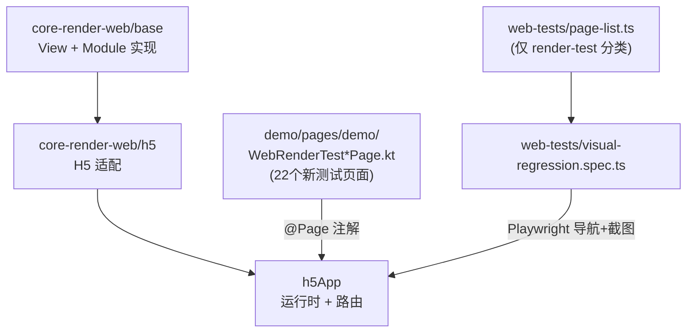

## 用户需求

移除项目中已有的全部 Playwright demo 测试用例和基准快照图片，编写一套全新的、基于 `core-render-web/base` 和 `core-render-web/h5` 源码的系统化测试页面，全面覆盖 Web Render 层所有 View 组件属性、call 方法及 Module 方法。

## 产品概述

当前项目的 Playwright 视觉回归测试复用 demo 演示页面，覆盖面不完整。需要：

1. 删除 `page-list.ts` 中全部已有的 demo 分类 PageEntry（约 70+ 条）
2. 删除 `web-tests/__screenshots__/desktop-chrome/` 下的全部 132 张基准快照 PNG
3. 删除 `web-tests/single-page.spec.ts-snapshots/` 下的 2 张快照 PNG
4. 创建约 22 个专用测试页面（Kotlin KTV DSL），每个页面聚焦一个 View 组件或 Module 模块的全属性/全方法覆盖
5. 在 `page-list.ts` 中仅注册新测试页面（`render-test` 分类），配合交互组实现自动化测试

## 核心功能

### 一、清理已有测试内容

- 清空 page-list.ts 中 pages 数组的全部 demo 条目
- 删除 `__screenshots__/desktop-chrome/` 下全部 132 张 PNG 基准快照
- 删除 `single-page.spec.ts-snapshots/` 下全部 2 张 PNG 快照

### 二、View 组件属性全覆盖测试页面（13 个）

通用属性页（frame/opacity/visibility/overflow/backgroundColor/transform/backgroundImage/boxShadow/borderRadius/border/zIndex 等 20+ 属性）、KRView 事件页、KRImageView 页、KRRichTextView 页、KRTextFieldView 页、KRTextAreaView 页、KRListView 页、KRVideoView 页、KRCanvasView 页、KRActivityIndicatorView 页、KRBlurView 页、KRHoverView 页、KRMaskView 页

### 三、Module 模块方法全覆盖测试页面（9 个）

CalendarModule、CodecModule、LogModule、MemoryCacheModule、SharedPreferencesModule、NotifyModule、RouterModule、NetworkModule、H5WindowResizeModule

### 四、Playwright 测试配置更新

page-list.ts 仅注册 render-test 分类的 22 个 PageEntry，配合交互组（scroll/click/input）覆盖需要交互触发的属性

## 技术栈

- **测试页面**: Kotlin Multiplatform + KTV 声明式 DSL（继承 BasePager/Pager）
- **页面注册**: @Page 注解 + KSP 编译期自动注册
- **测试框架**: Playwright + TypeScript
- **视觉回归**: Playwright toHaveScreenshot 全页面截图对比

## 实现方案

### 整体策略

采用"按组件/模块拆分测试页面"策略。每个 View 组件和 Module 模块各创建一个专门的测试页面，页面内部以分区块方式展示该组件的每一个属性效果。清除全部现有 demo 测试用例和快照，仅保留新建的 render-test 分类页面。

### 关键技术决策

1. **使用 KTV DSL 而非 Compose 模式**: KTV DSL 与底层 render 属性映射更直接（`View`/`Text`/`Image`/`Canvas` 等 DSL 函数直接对应 `KRView`/`KRRichTextView`/`KRImageView`/`KRCanvasView`），更适合精确测试每个属性。参考现有 `CodecTestPager`、`CanvasExamplePage`、`EventDemoPage` 等的编写模式。

2. **测试页面放置在 `demo/src/commonMain/.../pages/demo/` 目录**: 遵循现有约定，使用 `WebRenderTest` 前缀命名。

3. **categories 替换为 `['render-test']`**: 在 page-list.ts 中彻底替换，不保留 demo 分类。

4. **Module 测试通过 UI 反馈验证**: 参考 `CodecTestPager` 模式——在 `created()` 中调用模块方法、将结果存入 `observable` 变量、通过 `Text` 组件展示结果，Playwright 截图对比。

5. **事件类属性通过状态文本验证**: 参考 `EventDemoPage` 中 pan 手势模式——事件触发后更新 `observable` 状态变量，驱动 Text 显示触发状态，Playwright 交互后截图验证。

6. **确定性渲染原则**: 不依赖网络数据、随机数、不稳定时间戳，使用固定输入值（如固定字符串 `"hello,kuikly!"`、固定时间戳 `1700000000000L`）。

### 页面命名规范

| 测试目标 | @Page 名 | Kotlin 类名 |
| --- | --- | --- |
| 通用属性 | WebRenderTestCommonProps | WebRenderTestCommonPropsPage |
| KRView 事件 | WebRenderTestViewEvent | WebRenderTestViewEventPage |
| KRImageView | WebRenderTestImage | WebRenderTestImagePage |
| KRRichTextView | WebRenderTestRichText | WebRenderTestRichTextPage |
| KRTextFieldView | WebRenderTestTextField | WebRenderTestTextFieldPage |
| KRTextAreaView | WebRenderTestTextArea | WebRenderTestTextAreaPage |
| KRListView | WebRenderTestList | WebRenderTestListPage |
| KRVideoView | WebRenderTestVideo | WebRenderTestVideoPage |
| KRCanvasView | WebRenderTestCanvas | WebRenderTestCanvasPage |
| KRActivityIndicator | WebRenderTestIndicator | WebRenderTestIndicatorPage |
| KRBlurView | WebRenderTestBlur | WebRenderTestBlurPage |
| KRHoverView | WebRenderTestHover | WebRenderTestHoverPage |
| KRMaskView | WebRenderTestMask | WebRenderTestMaskPage |
| CalendarModule | WebRenderTestCalendar | WebRenderTestCalendarPage |
| CodecModule | WebRenderTestCodec | WebRenderTestCodecPage |
| LogModule | WebRenderTestLog | WebRenderTestLogPage |
| MemoryCacheModule | WebRenderTestMemoryCache | WebRenderTestMemoryCachePage |
| SharedPreferences | WebRenderTestSharedPref | WebRenderTestSharedPrefPage |
| NotifyModule | WebRenderTestNotify | WebRenderTestNotifyPage |
| RouterModule | WebRenderTestRouter | WebRenderTestRouterPage |
| NetworkModule | WebRenderTestNetwork | WebRenderTestNetworkPage |
| WindowResizeModule | WebRenderTestWindowResize | WebRenderTestWindowResizePage |


## 实现细节

### 测试页面设计原则

1. **确定性渲染**: 不依赖网络/随机/时间等不确定因素。Module 测试使用固定输入值。
2. **分块布局**: 每个页面使用 `List`/`Scroller` 容器，内部按属性分区块（标题 Text + 演示 View），通过 scroll 交互截取多屏。
3. **事件验证模式**: 参考 `EventDemoPage`，事件回调更新 `observable` 状态，Text 显示触发状态。
4. **视频/PAG**: 使用纯色或已有项目内测试资源URL，确保确定性。

### Playwright 配置要点

- 大部分页面配置 `SCROLL_DOWN` 交互覆盖页面下半部分
- 事件测试页配置 click/swipe 交互步骤
- 输入测试页配置 input 交互步骤
- 默认 `waitTime: 2000` 即可

### 性能考虑

- 每个页面聚焦一个组件，页面体积小
- 避免页面内放置过多重复组件
- 22 个页面并行执行（playwright workers=4），总耗时可控

## 架构设计



## 目录结构

```
web-tests/
├── __screenshots__/desktop-chrome/     # [DELETE ALL] 删除全部 132 张已有基准快照 PNG
├── single-page.spec.ts-snapshots/      # [DELETE ALL] 删除全部 2 张已有快照 PNG
├── page-list.ts                        # [MODIFY] 清空 pages 数组中全部 demo 条目，替换为 22 个 render-test 分类 PageEntry；categories 替换为 ['render-test']
├── visual-regression.spec.ts           # 无需修改，自动遍历 page-list.ts
└── interaction-runner.ts               # 无需修改

demo/src/commonMain/kotlin/com/tencent/kuikly/demo/pages/demo/web
├── WebRenderTestCommonPropsPage.kt     # [NEW] 通用 CSS 属性全覆盖。继承 BasePager，List 容器分区块展示 frame/opacity/visibility/overflow/backgroundColor/touchEnable/transform(rotate+scale+translate+skew)/backgroundImage/boxShadow/textShadow/strokeWidth+strokeColor/borderRadius(含各角独立)/border/maskLinearGradient/color/zIndex/accessibility 等 20+ 属性。
├── WebRenderTestViewEventPage.kt       # [NEW] KRView 事件属性。覆盖 click/doubleClick/longPress/pan/touchDown+touchMove+touchUp，每个事件绑定一个 View 区域，触发后更新 observable 状态 Text 显示结果。
├── WebRenderTestImagePage.kt           # [NEW] KRImageView 全属性。覆盖 src(URL+base64)/resize(stretch+contain+cover)/tintColor/blurRadius，loadSuccess/loadFailure/loadResolution 回调结果通过 Text 展示。
├── WebRenderTestRichTextPage.kt        # [NEW] KRRichTextView 全属性。覆盖 numberOfLines/lineBreakMode/headIndent/values(富文本Span)/text/color/letterSpacing/textDecoration/textAlign(left+center+right)/lineSpacing/lineHeight/fontWeight+fontStyle+fontFamily+fontSize/backgroundImage(渐变文字)/strokeWidth+strokeColor。使用 RichText + Span DSL。
├── WebRenderTestTextFieldPage.kt       # [NEW] KRTextFieldView 全属性。覆盖 text/placeholder/placeholderColor/textAlign/fontSize/fontWeight/tintColor/maxTextLength/editable/keyboardType/returnKeyType 及 focus/blur call。
├── WebRenderTestTextAreaPage.kt        # [NEW] KRTextAreaView 全属性。覆盖多行输入，与 TextField 属性对照。
├── WebRenderTestListPage.kt            # [NEW] KRListView/KRScrollView 全属性。覆盖 scrollEnabled/showScrollerIndicator/directionRow(水平+垂直)/pagingEnabled/bouncesEnable/nestedScroll 及 contentOffset/contentInset call。
├── WebRenderTestVideoPage.kt           # [NEW] KRVideoView 全属性。覆盖 src/muted/rate/resizeMode(contain+cover+fill)/playControl 及状态回调。
├── WebRenderTestCanvasPage.kt          # [NEW] KRCanvasView 全方法。覆盖 beginPath/moveTo/lineTo/arc/closePath/stroke/strokeStyle/fill/fillStyle/fillText/strokeText/lineWidth/lineCap/lineDash/quadraticCurveTo/bezierCurveTo/clip/reset。参考 CanvasExamplePage 的 Canvas DSL 回调模式。
├── WebRenderTestIndicatorPage.kt       # [NEW] KRActivityIndicatorView。覆盖 style(gray+white) 两种模式。
├── WebRenderTestBlurPage.kt            # [NEW] KRBlurView。覆盖不同 blurRadius 值的对比效果。
├── WebRenderTestHoverPage.kt           # [NEW] KRHoverView。覆盖 hoverMarginTop/bringIndex，通过 scroll 验证吸顶效果。
├── WebRenderTestMaskPage.kt            # [NEW] KRMaskView。验证遮罩容器效果。
├── WebRenderTestCalendarPage.kt        # [NEW] CalendarModule。参考 CalendarModuleExamplePage 模式，使用固定时间戳调用 cur_timestamp/get_field/get_time_in_millis/format/parse_format，结果 Text 展示。
├── WebRenderTestCodecPage.kt           # [NEW] CodecModule。参考 CodecTestPager 模式，固定字符串调用 urlEncode/urlDecode/base64Encode/base64Decode/md5/md5With32/sha256，结果 Text 展示。
├── WebRenderTestLogPage.kt             # [NEW] LogModule。调用 logInfo/logDebug/logError，UI 展示调用状态。
├── WebRenderTestMemoryCachePage.kt     # [NEW] MemoryCacheModule。setObject 后 get 验证，结果 Text 展示。
├── WebRenderTestSharedPrefPage.kt      # [NEW] SharedPreferencesModule。setItem/getItem，结果 Text 展示。
├── WebRenderTestNotifyPage.kt          # [NEW] NotifyModule。addNotify/postNotify/removeNotify 完整流程，通过 observable Text 显示事件收发结果。
├── WebRenderTestRouterPage.kt          # [NEW] RouterModule。展示 openPage/closePage 入口（不实际跳转，展示调用参数）。
├── WebRenderTestNetworkPage.kt         # [NEW] NetworkModule。httpRequest(GET) 发送固定测试请求，通过 observable 展示结果。
└── WebRenderTestWindowResizePage.kt    # [NEW] H5WindowResizeModule。listenWindowSizeChange 展示当前窗口尺寸。
```

## Agent Extensions

### SubAgent

- **code-explorer**
- Purpose: 在编写每个测试页面时，搜索对应 View 组件或 Module 的源码，确认全部 setProp 属性键名、call 方法名及参数签名，确保覆盖无遗漏
- Expected outcome: 每个测试页面精确覆盖 core-render-web 源码中定义的全部属性和方法